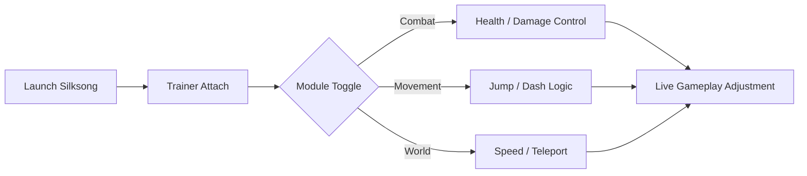

# Hollow Knight: Silksong Trainer

There are games that whisper, and there are games that sing. **Hollow Knight: Silksong** does both—threads of danger and beauty vibrating through every jump, every needle strike. This trainer exists not to shatter that music, but to let you conduct it.

Whether you’re refining boss practice, exploring Silk’s vertical labyrinths, or simply seeking gentler pacing, this PC trainer gives you control without noise, power without chaos.


---

## 🌸 Overview: A Tool Built for Control, Not Chaos

The **Hollow Knight: Silksong Trainer** is a lightweight Windows-based enhancement layer designed for single-player exploration and skill refinement. It injects cleanly, runs silently, and gives you adjustable levers over health, movement, resources, and time itself.

This is not a blunt instrument. It’s a tuning fork—precise, reversible, and respectful of the game’s rhythm.

Use it to:

* Practice high-difficulty encounters without repetition fatigue
* Explore unreachable zones for mapping and study
* Adjust pacing for accessibility or content creation

---

## 🎯 Core Features & Modules

Each module is optional, toggleable, and hotkey-driven. Nothing forces itself into your play.

### Combat & Survival

* **Infinite Health / Mask Lock** – Learn bosses without punishment
* **Enemy Damage Scale** – Reduce or amplify incoming threats
* **One-Hit Mode** – Practice precision timing

### Movement & Flow

* **Jump Height Control** – Reach vertical paths with grace
* **Dash Cooldown Toggle** – Explore speedrun routes
* **Fall Damage Disable** – Focus on navigation, not penalty

### Resources & Economy

* **Rosary Bead Editor** – Fine-tune upgrades
* **Geo Control** – Lock, add, or test shop routes
* **Skill Cooldown Reset** – Continuous ability testing

### World & Time

* **Game Speed Slider** – Slow-motion study or fast traversal
* **Freeze World State** – Analyze enemy patterns
* **Checkpoint Teleport** – Instant repositioning
  
---

## 🚀 Setup Guide (Clean & Simple)

Installation is intentionally frictionless—no installers, no background services.

### Steps

1. Launch **Hollow Knight: Silksong**
2. Run the trainer executable as administrator
3. Press **Attach** once the game is detected
4. Use hotkeys or UI toggles to activate modules

### Example Hotkeys

```text
F1 – Infinite Health
F2 – Infinite Dash
F3 – Game Speed Toggle
F4 – Teleport to Checkpoint
```

> [!IMPORTANT]
> Always start the game **before** attaching the trainer to ensure stable memory mapping.

---

## 🧭 How the Trainer Interacts with the Game



Each change is applied in real time and can be reverted instantly—no save corruption, no permanent effects.

---

## ❓ FAQ – Calm Answers to Common Questions

**Is this safe for my save files?**
Yes. The trainer modifies runtime values only. Saves remain untouched.

**Will it affect performance?**
Negligibly. Memory footprint is under 20MB, with no background polling.

**Can I customize hotkeys?**
Absolutely. Every function is rebindable.

**Does it work with controllers?**
Yes. Trainer hotkeys coexist with controller input seamlessly.

**Will updates break it?**
Minor patches rarely do. Major updates are typically supported within 24–48 hours.

---

## 🌙 Final Thoughts

Silksong is a game of silk and steel—delicate, demanding, unforgettable. This trainer doesn’t dull its edge; it gives you a lantern. A way to see more clearly, practice more patiently, and explore more freely.

If you seek mastery, accessibility, or simply a different tempo, this tool waits quietly in the wings—ready when you are.
